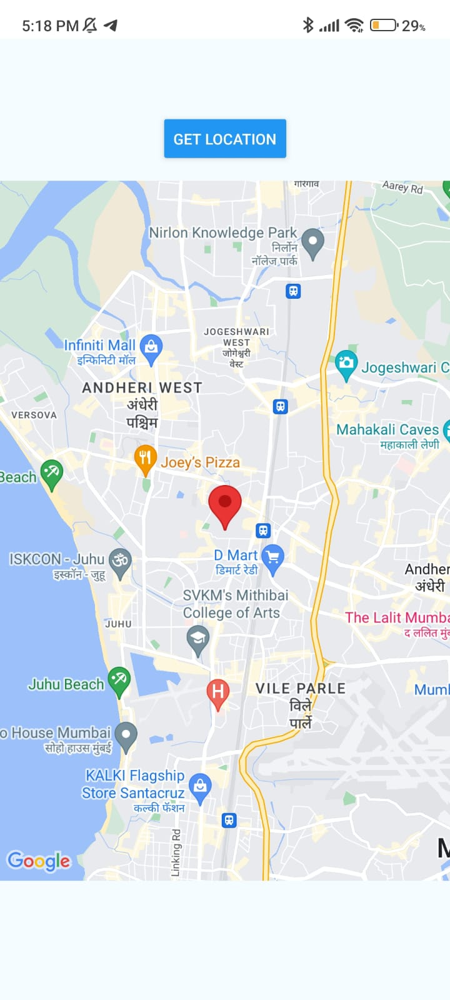

# GPS Location App

This React Native application utilizes the `react-native-maps` library to display a map view and fetches the device's current location using the `expo-location` package.

## Features

- Fetches and displays the device's current location on a map.
- Dynamically updates the user's location marker as their position changes.
- Allows users to initiate the process of fetching their location with a button press.

## Screenshots

<div style={display:'flex'}>


</div>

## Installation

To run the application on your local machine, follow these steps:

1. Clone the repository:
   ```
   git clone https://github.com/rsayyed591/selfGPSLocator.git
   ```
2. Navigate to the project directory:
   ```
   cd your-repo
   ```
3. Install dependencies:
   ```
   npm install
   ```
4. Start the application:
   ```
   npm start
   ```
5. Scan the QR code using the Expo Go app on your mobile device to open the application.

## Technologies Used

- React Native
- `react-native-maps`
- `expo-location`

## Usage

1. Press the "Get Location" button to fetch the device's current location.
2. The map will display with a marker indicating the fetched location.
